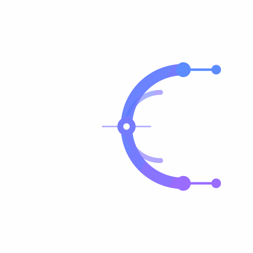

<!-- ===== LOGO ===== -->

<!-- ===== WORDMARK ===== -->

<!-- ===== TAGLINE ===== -->

  

<!-- ===== STATUS BADGES ===== -->

  
  
  

<!-- ===== GRADIENT DIVIDER ===== -->

## 🧠 About CirqAi

> **`where code meets intelligence`**

We are **CirqAi** — a collective building at the intersection of software engineering and artificial intelligence. We craft tools, models, and infrastructure that turn raw code into intelligent systems.

- 🔭 We're building **AI-powered products and developer tooling**
- 🌱 We believe in **clean code, open knowledge, and reproducible research**
- 🤝 We're **open to collaboration** — contributors, researchers, and tinkerers welcome
- ⚡ Fun fact: every great model starts with a single, well-written function

## 🚀 What We Do

<table>
  <tr>
    <td align="center" width="33%">
      <h3>🤖 AI &amp; ML</h3>
      
Designing, training, and deploying intelligent models that solve real problems.

    </td>
    <td align="center" width="33%">
      <h3>🛠️ Tooling</h3>
      
Developer-first libraries and platforms that make building with AI effortless.

    </td>
    <td align="center" width="33%">
      <h3>☁️ Infrastructure</h3>
      
Scalable, secure, cloud-native systems that power intelligence at scale.

    </td>
  </tr>
</table>

## 🧰 Tech Stack

<!-- ## 📊 Organisation Stats

 -->

<!-- ## 📊 By The Numbers

 -->

## 🤝 Connect With Us

<!--  -->
<!--  -->

 

**⭐ Star our repos · 🍴 Fork what inspires you · 🚀 Build with us**

